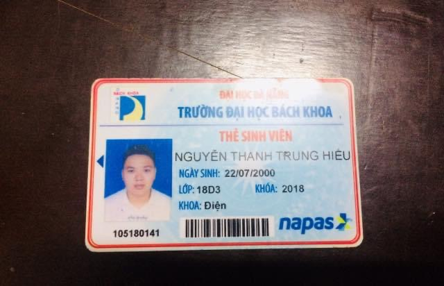
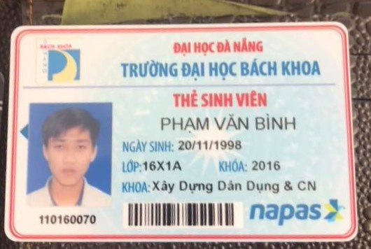
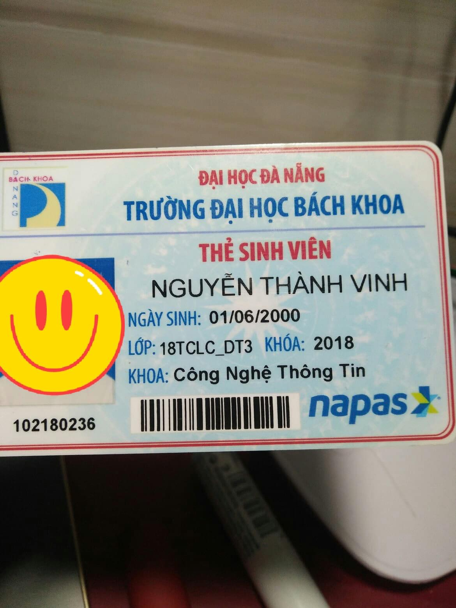

# Student ID Card Recognition

## Table of contents

* [Overview](#overview)
* [System](#system)
    * [Technologies](#technologies)
    * [Features](#features)
    * [Performance](#performance)
    * [Requirements](#requirements)
* [Status](#status)
* [Test](#how-to-test)
* [Contact](#contact)

## Overview

Student ID Card Recognition is my AI's project for scanning and extracting information from DUT's Student ID Card with
Image Processing and state-of-the-art Deep Learning's model (YOLO + Transformer).

## Application

Student ID Card Recognition can be applied with License Plate Recognition to build a parking lot for Da Nang University
of Technology.

## System

### Technologies

* Image Processing with **OpenCV**
* Object Detection with **YOLOv4-tiny**
* Text Recognition with **Transformer**
* **Flask-Python** to create API and build website
* **Docker** for deployment

### Features

Current features:

* The main function of system is to identify and extract information from Student ID Card photo. Users can upload a card
  image to the system, and this system will return extracted information from the photo, for example:
    * ID Number
    * Full name
    * Class name
    * Date of birth
    * Faculty
    * Year

To-do list:

* Use an Object Detection model (YOLO, SSD, etc) for scanning ID Card in the input image instead of use Image
  Processing.
* Add one more function to this system: Vietnamese ID Card Recognition

### Performance

Because I don't have a server with GPU, so the processing time is quite long. The average processing time is:

* Server without GPU(4 Cores, 4 GB RAM): 2 - 5 seconds/photo.

### Requirements

* The input image must have 4 clear angles and its background should be white or gray and not contain anything else 
  :disappointed_relieved: to make sure the ID Card can be _seen_.
* All information fields must be visible, readable, unmodified and not blurred.
* The input image size does not exceed **5 MB**, and the minimum resolution is approximately **640x480** to ensure the
  confident rate.
* The ratio of Student ID Card area must be at least 2&frasl;3 of the total image area.

#### Standard image

#### Bad image

* Image with lack of corner
  

## How to test

I have built a simple [**website**](http://student-ocr.southeastasia.azurecontainer.io) to show how it works. However,
to use this website you need a Student ID Card as your input image. So, please download
the [test-img folder](https://drive.google.com/drive/folders/1tOklpJxGfGlmfr4Ui1fSAEN_lPZVU5H_?usp=sharing) then use one
of them. Sorry for this inconvenience :disappointed:

## Status

Project is _no longer continue_ because I'm dying with my mind :cry:

## Contact

Created by [@dvt](https://www.facebook.com/trinh.dvt/) - feel free to contact me!
